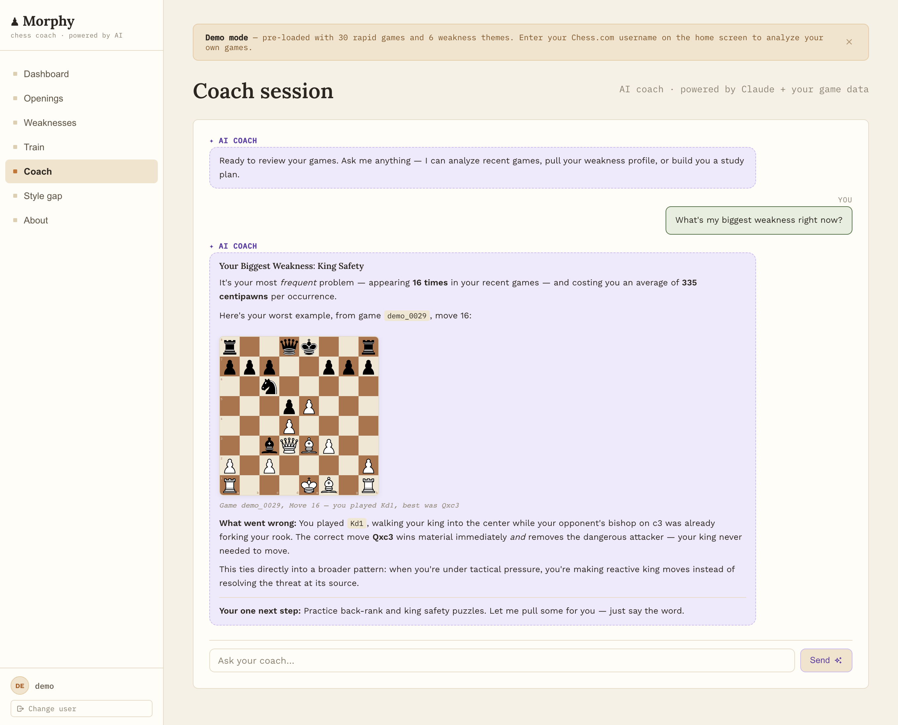
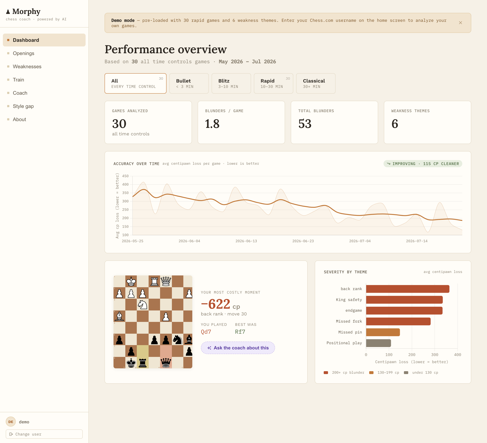
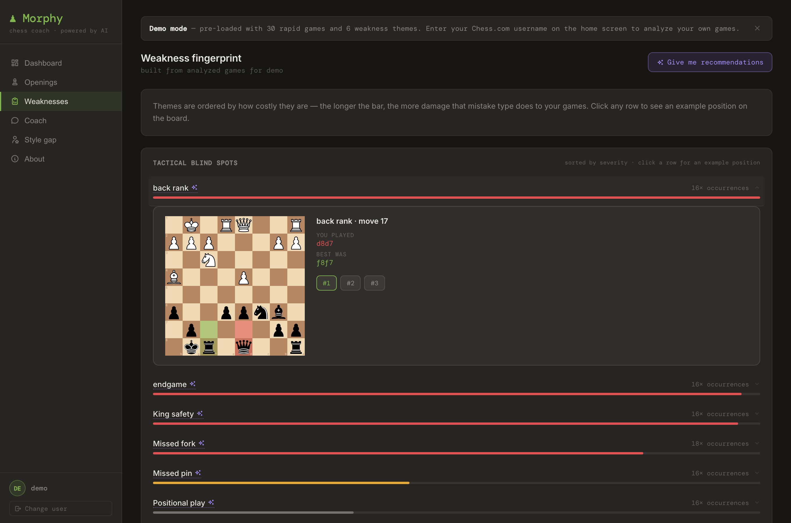
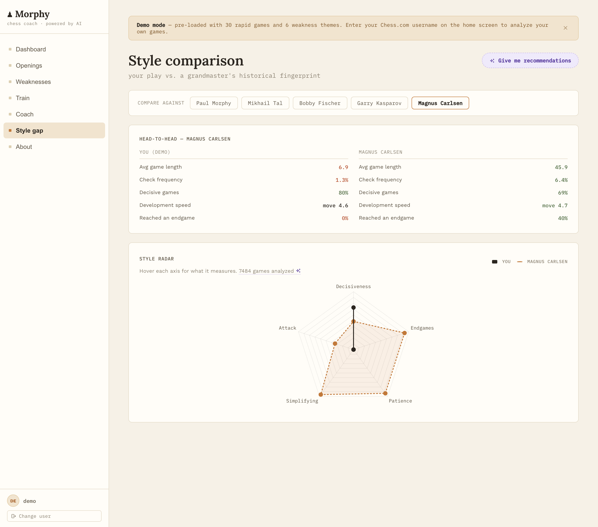

# MORPHY

**An AI chess coach that ingests your Chess.com games, runs Stockfish on every position, profiles your recurring mistakes, and lets you chat with a Claude-powered agent that has live access to all of it — and shows you the positions on a real board.**

**[Try the live demo →](https://morphy-jade.vercel.app)** *(no account needed — click "Try demo")*



> The coach isn't a chatbot bolted onto a prompt. It runs an agentic tool-use loop: it pulls your actual game data mid-conversation, cites real move numbers and centipawn losses, renders the exact position you blundered in, explains *why* the engine's move was better, spots the pattern across your games, and ends with a concrete drill.

---

## Why this project is interesting (for engineers)

- **A real agentic loop, not a single prompt.** `/coach` runs Claude in a tool-use loop (up to 10 iterations) with five tools over your live database. Claude decides what data it needs, calls tools, reasons over the results, and can call more before answering. ([`backend/agent/coach_agent.py`](backend/agent/coach_agent.py))
- **Grounded, position-aware output.** Tool results embed the FEN of every blunder, so the model renders *your* real positions on an interactive board instead of inventing them. The system prompt forces it to explain the engine's reasoning and tie mistakes to your recurring weakness themes. ([`backend/agent/tools.py`](backend/agent/tools.py), [`backend/agent/prompts.py`](backend/agent/prompts.py))
- **Prompt caching for latency + cost.** The static system prompt and tool definitions are marked `cache_control: ephemeral` and kept separate from per-user context, so the cache is shared across turns.
- **A genuine analysis pipeline.** Chess.com ingest → per-position Stockfish evaluation → rule-based tactical-motif classification (fork, pin, skewer, back-rank, discovered check…) → per-theme weakness profiling with feature-vector centroids. A FEN-keyed cache means identical positions are never re-analyzed. ([`backend/analysis/`](backend/analysis), [`backend/profiler/`](backend/profiler))
- **Built to survive real input.** One corrupt game can't kill a batch (per-game failure isolation), duplicate ingest requests are de-duplicated instead of spawning parallel engine runs, and Stockfish resolution falls back across install paths for portable deploys.
- **Shipped like production.** GitHub Actions CI on every PR (typecheck, lint, 62 tests, build), Dockerized backend on Render, static frontend on Vercel with per-PR preview deployments, and a nightly scheduler that refreshes tracked users' data.

---

## Screenshots

| Dashboard — performance overview | Weakness fingerprint |
|---|---|
|  |  |
| Games, blunder rate, and severity-by-theme, filterable by time control. | Themes sorted by how many points they cost you; click any row to see the exact blunder on a board with the played vs. best move highlighted. |

| Style comparison vs. a grandmaster | AI coach |
|---|---|
|  |  |
| Your play mapped against a GM's historical fingerprint across five style axes. | Agentic tool-use over your live game data, with inline interactive boards. |

---

## What it does

1. **Ingests** your public Chess.com games via their API (configurable lookback).
2. **Analyses** every position with Stockfish — best move, centipawn loss, blunder classification.
3. **Classifies** each blunder's tactical motif with python-chess board logic (missed fork, pin, skewer, back-rank mate, discovered check, hanging piece, king safety…).
4. **Profiles** your persistent weaknesses by aggregating motifs across all games — frequency, severity, and a stored position-feature centroid per theme.
5. **Compares** your style to grandmasters (Morphy, Tal, Fischer, Kasparov, Carlsen) across development speed, open-file control, king attack, sacrifice rate, and aggression.
6. **Coaches** you through a multi-turn Claude agent that pulls all of the above — plus Lichess practice puzzles — mid-conversation and renders positions on an interactive board.

---

## Architecture

```
Chess.com API
      │
      ▼
POST /ingest/{username}                      ← background job; deduped per active user
      │
      ├─ fetch games (httpx, month-by-month)
      ├─ Stockfish analysis (FEN-cached, per-game failure isolation)
      ├─ tactical-motif classification (python-chess)
      ├─ weakness profiling (per-theme aggregation + feature centroids)
      └─ persist to SQLite (dev) / Postgres (prod)
                  │
                  ▼
         GET  /profile/{username}     · weakness fingerprint + summary stats
         GET  /style-gap/{username}   · style radar vs. a GM
         GET  /blunders/{username}    · example positions per theme
         GET  /openings/{username}    · repertoire win/loss + accuracy
         POST /coach                  · agentic loop: Claude + 5 tools over live data

  APScheduler → nightly refresh of tracked users (ingest → analyze → re-profile)
```

### The AI coach loop

Each message to `/coach` runs an agentic loop:

1. Claude reads conversation history + a prompt-cached system prompt and tool schema.
2. If it needs data, it calls one or more tools — `get_recent_games`, `get_weakness_profile`, `get_game_details`, `get_opening_stats`, `fetch_practice_puzzles` — executed server-side against your database.
3. Tool results (including FENs for every blunder) are fed back; Claude decides whether to call more tools or respond.
4. The final answer can embed ` ```chess-board ` fenced blocks with a FEN + label, which the frontend renders as interactive boards.

History is capped to bound token cost; the static prompt and tool definitions are cached to cut latency on follow-ups.

---

## Stack

| Layer | Tech |
|---|---|
| Frontend | React 18, Vite, Chart.js, react-chessboard, react-markdown |
| Backend | FastAPI, SQLAlchemy, SQLite (dev) / Postgres (prod) |
| Analysis | Stockfish via python-chess; NumPy/scikit-learn for position features |
| AI coach | Anthropic Claude — tool-use agentic loop with prompt caching |
| Puzzles | Lichess API |
| CI/CD | GitHub Actions · Render (Docker) · Vercel |

---

## Engineering practices

- **CI on every push and PR** ([`.github/workflows/ci.yml`](.github/workflows/ci.yml)): backend `pytest`, frontend `tsc --noEmit` typecheck, ESLint, Vitest, and a production build. Any failure blocks the merge.
- **62 tests.** 55 backend (`pytest`) covering the stats engine, PGN parser, tactical classifier, and job dedupe; 7 frontend (Vitest) covering client utilities.
- **Preview deployments.** Vercel builds a live preview for every PR automatically.
- **Reliability by design.** Per-game failure isolation, ingest-job de-duplication, graceful Stockfish path resolution, and a `/health/stockfish` diagnostic endpoint.

---

## Local development

### Prerequisites

- Python 3.11+, Node 18+
- Stockfish: `brew install stockfish` (macOS) or `apt-get install stockfish` (Linux)
- An [Anthropic API key](https://console.anthropic.com) for the AI coach

### Backend

```bash
cd backend
python3 -m venv .venv && source .venv/bin/activate
pip install -r requirements.txt

cp .env.example .env       # set ANTHROPIC_API_KEY=sk-ant-...

uvicorn main:app --reload --port 8000
```

Demo user and GM style profiles are seeded automatically on first startup.

### Frontend

```bash
cd frontend
npm install
npm run dev
```

Open [http://localhost:5173](http://localhost:5173). Enter your Chess.com username, or click **Try demo** for pre-loaded games.

### Tests

```bash
cd backend && python -m pytest tests/ -v      # 55 backend tests
cd frontend && npm test                        # 7 frontend tests
npm run lint && npm run typecheck              # ESLint + tsc
```

---

## Deployment

The frontend is a static Vite build. The backend needs Stockfish, persistent storage, and long-running jobs, so it runs as a Docker service (not serverless).

**Backend — [Render](https://render.com)** (config in [`render.yaml`](render.yaml)): a Docker service built from `backend/Dockerfile`, which installs Stockfish via apt and verifies the binary at build time. Set `ANTHROPIC_API_KEY` and `CORS_ORIGINS`. Deploy it as a **Blueprint** so `render.yaml` is actually applied — a service created by hand in the dashboard ignores that file and won't use the Dockerfile. On the free plan there's no persistent disk, so SQLite resets on restart (demo and GM profiles re-seed automatically); attach Postgres or a disk for durable storage.

**Frontend — [Vercel](https://vercel.com)**: import the repo, root `frontend`, set `VITE_API_URL` to your Render URL. Preview deployments are automatic on every PR.
