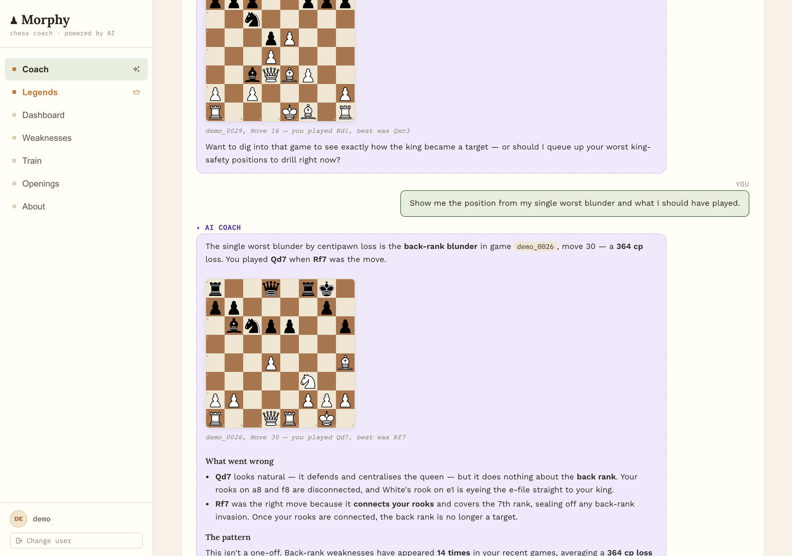
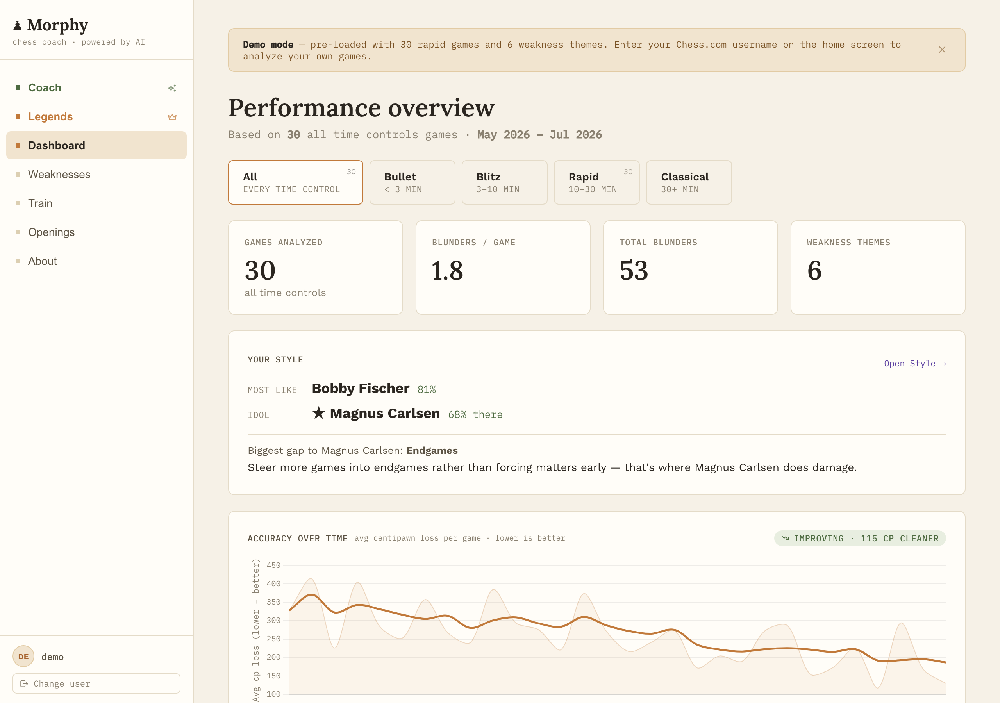
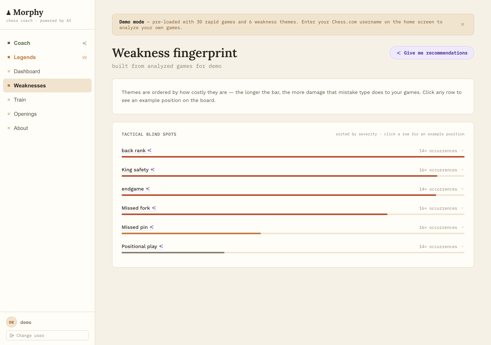
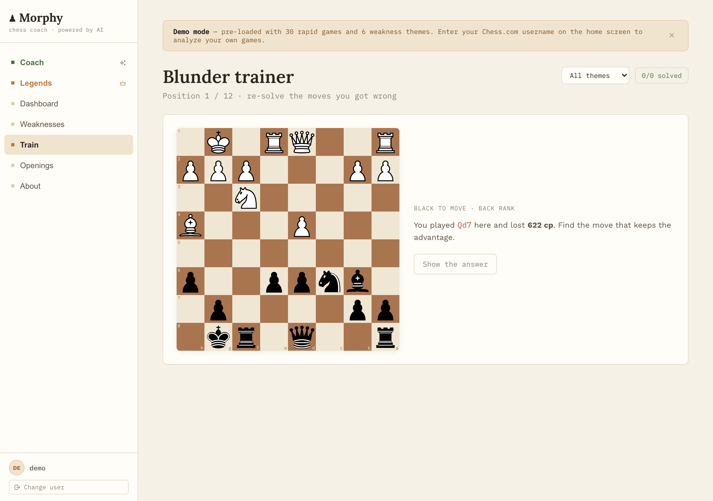
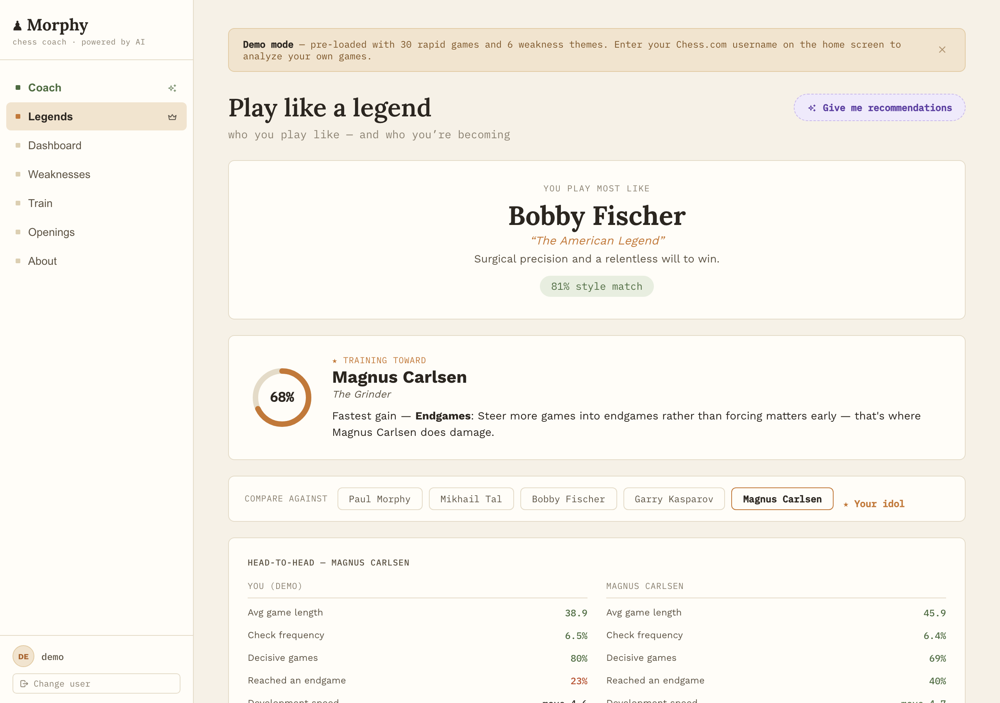

# MORPHY

**An AI chess coach that ingests your Chess.com games, runs Stockfish on every position, profiles your recurring mistakes, lets you chat with a Claude-powered agent that has live access to your data, drills you on the exact positions you got wrong with spaced repetition, and shows you which legend you play like — and who you're becoming.**

**[Try the live demo →](https://morphy-jade.vercel.app)** *(no account needed — click "Try demo")*



> The coach isn't a chatbot bolted onto a prompt. It runs an agentic tool-use loop: it pulls your actual game data mid-conversation, cites real move numbers and centipawn losses, renders the exact position you blundered in, explains *why* the engine's move was better, spots the pattern across your games, and ends with a concrete drill.

---

## Why this project is interesting (for engineers)

- **An agentic loop.** `/coach` runs Claude in a tool-use loop (up to 10 iterations) with five tools over your live database. Claude decides what data it needs, calls tools, reasons over the results, and can call more before answering. ([`backend/agent/coach_agent.py`](backend/agent/coach_agent.py))
- **Grounded, position-aware output.** Tool results embed the FEN of every blunder, so the model renders *your* real positions on an interactive board instead of inventing them. The system prompt forces it to explain the engine's reasoning and tie mistakes to your recurring weakness themes. ([`backend/agent/tools.py`](backend/agent/tools.py), [`backend/agent/prompts.py`](backend/agent/prompts.py))
- **Prompt caching for latency + cost.** The static system prompt and tool definitions are marked `cache_control: ephemeral` and kept separate from per-user context, so the cache is shared across turns.
- **A genuine analysis pipeline.** Chess.com ingest → per-position Stockfish evaluation → rule-based tactical-motif classification (fork, pin, skewer, back-rank, hung piece, bad trade, pawn weakness…) → per-motif weakness profiling (frequency + average severity). A FEN-keyed cache skips repeat positions, and ingest is bounded to the analysis window so even a hyperactive account (hundreds of games/month) stays fast. ([`backend/analysis/`](backend/analysis), [`backend/profiler/`](backend/profiler))
- **A closed practice loop, not a diagnosis.** The trainer re-serves the exact positions *you* blundered — not generic puzzles — scheduled by a Leitner spaced-repetition system: fail one and it resurfaces, master it and it's pushed out. Per-theme mastery tracking turns the weakness report into a progress bar. ([`backend/profiler/spaced_repetition.py`](backend/profiler/spaced_repetition.py))
- **"Play like a legend."** Five grandmasters' full game archives — **13,081 games** — are parsed and reduced to style fingerprints across the same five axes computed for you, so the comparison is apples-to-apples rather than against a hand-written profile. That tells you who you naturally play like, how close you are to the idol you're training toward, and the one habit that closes the biggest gap. The corpus is precomputed into a committed `profiles.json` so deployed instances need no PGN data. ([`backend/gm/compute_style.py`](backend/gm/compute_style.py), [`backend/stats.py`](backend/stats.py))
- **Built to survive real input.** One corrupt game can't kill a batch (per-game failure isolation), duplicate ingest requests are de-duplicated instead of spawning parallel engine runs, and Stockfish resolution falls back across install paths for portable deploys.
- **Shipped like production.** GitHub Actions CI on every PR (typecheck, lint, 140 tests, build), Dockerized backend on Render, static frontend on Vercel with per-PR preview deployments, and a nightly scheduler that refreshes tracked users' data.

---

## Screenshots

| Dashboard — performance overview | Weakness fingerprint |
|---|---|
|  |  |
| Accuracy-over-time trend, your most costly blunder on a board, and severity-by-theme — filterable by time control. | Themes sorted by how many points they cost you; click any row to see the exact blunder on a board with the played vs. best move highlighted. |

| Blunder trainer (spaced repetition) | Legends — play like a legend |
|---|---|
|  |  |
| Re-solve the positions you actually got wrong. Fail one and it resurfaces; master it and it's pushed out — with per-theme mastery tracking. | Which legend you play like, how close you are to the idol you're training toward, and the one habit that closes the biggest gap. |

*(The AI coach is shown at the top of this README.)*

---

## What it does

1. **Ingests** your public Chess.com games via their API (configurable lookback).
2. **Analyses** every position with Stockfish — best move, centipawn loss, blunder classification.
3. **Classifies** each blunder's tactical motif with python-chess board logic (missed fork, pin, skewer, back-rank mate, discovered check, hanging piece, king safety…).
4. **Profiles** your persistent weaknesses by aggregating motifs across all games — one row per motif with its frequency and average severity (centipawn loss).
5. **Drills** you on the exact positions you blundered — a spaced-repetition trainer (Leitner boxes) that resurfaces the ones you fail and tracks mastery per theme, so the diagnosis becomes deliberate practice on *your own* mistakes.
6. **Matches** your style to grandmasters (Morphy, Tal, Fischer, Kasparov, Carlsen) across decisiveness, endgame tendency, patience (game length), simplification, and attack — telling you who you play like and how close you are to the idol you're training toward. Each legend's archive is run through the *same* analysis as your games (13,081 GM games in total), and the axes were chosen — and their normalization windows fitted — so the grandmasters actually separate from *each other*, not just from the amateur baseline.
7. **Coaches** you through a multi-turn Claude agent that pulls all of the above mid-conversation, renders positions on an interactive board, and can queue a drill of your own mistakes (topping up with Lichess puzzles only when you don't have enough of your own).

---

## Architecture

```
Chess.com API
      │
      ▼
POST /ingest/{username}                      ← background job; deduped per active user
      │
      ├─ fetch games (httpx, month-by-month)
      ├─ Stockfish analysis (FEN-cached, per-game failure isolation)
      ├─ tactical-motif classification (python-chess)
      ├─ weakness profiling (per-motif aggregation: frequency + avg severity)
      └─ persist via SQLAlchemy (SQLite by default; Postgres via DATABASE_URL)
                  │
                  ▼
         GET  /profile/{username}       · weakness fingerprint + summary stats
         GET  /style/{username}/match   · who you play like, ranked across all GMs
         GET  /style-gap/{username}     · style radar vs. one GM
         GET  /blunders/{username}      · example positions per theme
         GET  /openings/{username}      · repertoire win/loss + accuracy
         GET  /drill/{username}/queue   · spaced-repetition drill queue (due reviews first)
         POST /drill/{username}/attempt · record a drill result; reschedule the card
         GET  /drill/{username}/mastery · per-theme drill progress
         POST /coach                    · agentic loop: Claude + 5 tools over live data

  APScheduler → nightly refresh of tracked users (ingest → analyze → re-profile)
```

### The AI coach loop

Each message to `/coach` runs an agentic loop:

1. Claude reads conversation history + a prompt-cached system prompt and tool schema.
2. If it needs data, it calls one or more tools — `get_recent_games`, `get_weakness_profile`, `get_game_details`, `get_opening_stats`, `queue_practice` (drills your own blundered positions) — executed server-side against your database.
3. Tool results (including FENs for every blunder) are fed back; Claude decides whether to call more tools or respond.
4. The final answer can embed ` ```chess-board ` fenced blocks with a FEN + label, which the frontend renders as interactive boards.

History is capped to bound token cost; the static prompt and tool definitions are cached to cut latency on follow-ups.

---

## Stack

| Layer | Tech |
|---|---|
| Frontend | React 18, Vite, Chart.js, react-chessboard, react-markdown |
| Backend | FastAPI, SQLAlchemy, SQLite (Postgres-ready via `DATABASE_URL`) |
| Analysis | Stockfish via python-chess; rule-based tactical-motif classification |
| Practice | Leitner spaced repetition over your own blundered positions (Lichess API as fallback) |
| AI coach | Anthropic Claude — tool-use agentic loop with prompt caching |
| CI/CD | GitHub Actions · Render (Docker) · Vercel |

---

## Engineering practices

- **CI on every push and PR** ([`.github/workflows/ci.yml`](.github/workflows/ci.yml)): backend `pytest`, frontend `tsc --noEmit` typecheck, ESLint, Vitest, and a production build. Any failure blocks the merge.
- **140 tests.** 123 backend (`pytest`) covering the stats engine, PGN parser, tactical classifier, spaced-repetition scheduler, style-match, and job dedupe; 17 frontend (Vitest) covering client utilities.
- **Preview deployments.** Vercel builds a live preview for every PR automatically.
- **Reliability by design.** Per-game failure isolation, ingest-job de-duplication, graceful Stockfish path resolution, and a `/health/stockfish` diagnostic endpoint.

---

## Local development

### Prerequisites

- Python 3.11+, Node 18+
- Stockfish: `brew install stockfish` (macOS) or `apt-get install stockfish` (Linux)
- An [Anthropic API key](https://console.anthropic.com) for the AI coach

### Backend

```bash
cd backend
python3 -m venv .venv && source .venv/bin/activate
pip install -r requirements.txt

cp .env.example .env       # set ANTHROPIC_API_KEY=sk-ant-...

uvicorn main:app --reload --port 8000
```

Demo user and GM style profiles are seeded automatically on first startup.

### Frontend

```bash
cd frontend
npm install
npm run dev
```

Open [http://localhost:5173](http://localhost:5173). Enter your Chess.com username, or click **Try demo** for pre-loaded games.

### Tests

```bash
cd backend && python -m pytest tests/ -v      # 123 backend tests
cd frontend && npm test                        # 17 frontend tests
npm run lint && npm run typecheck              # ESLint + tsc
```

---

## Deployment

The frontend is a static Vite build. The backend needs Stockfish, persistent storage, and long-running jobs, so it runs as a Docker service (not serverless).

**Backend — [Render](https://render.com)** (config in [`render.yaml`](render.yaml)): a Docker service built from `backend/Dockerfile`, which installs Stockfish via apt and verifies the binary at build time. Set `ANTHROPIC_API_KEY` and `CORS_ORIGINS`. Deploy it as a **Blueprint** so `render.yaml` is actually applied — a service created by hand in the dashboard ignores that file and won't use the Dockerfile. The service runs on the **Starter** plan so it never cold-starts and has enough CPU that long Stockfish jobs aren't killed mid-run. For durable storage set `DATABASE_URL` to an external managed Postgres (e.g. a free [Neon](https://neon.tech) project); leave it unset and the app falls back to SQLite, which resets on restart (demo and GM profiles re-seed automatically).

**Frontend — [Vercel](https://vercel.com)**: import the repo, root `frontend`, set `VITE_API_URL` to your Render URL. Preview deployments are automatic on every PR.
