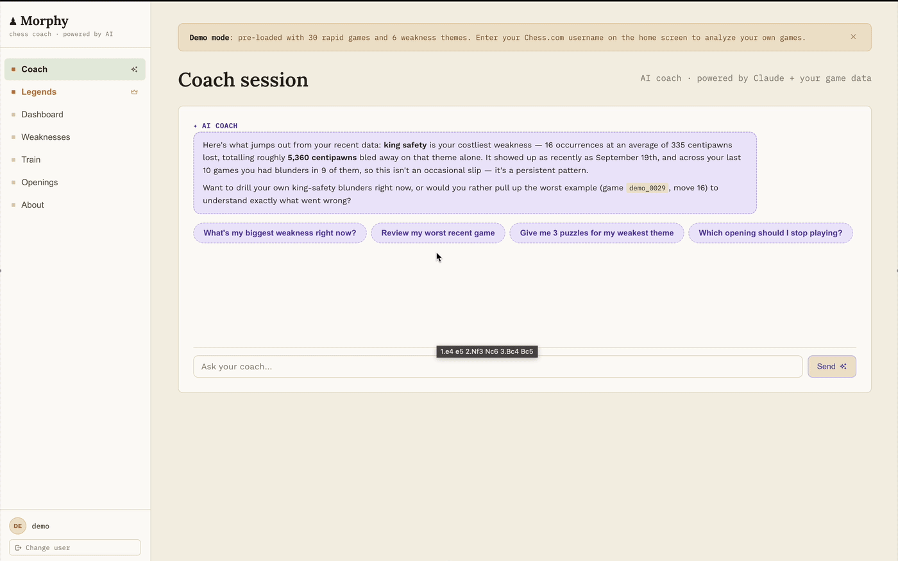
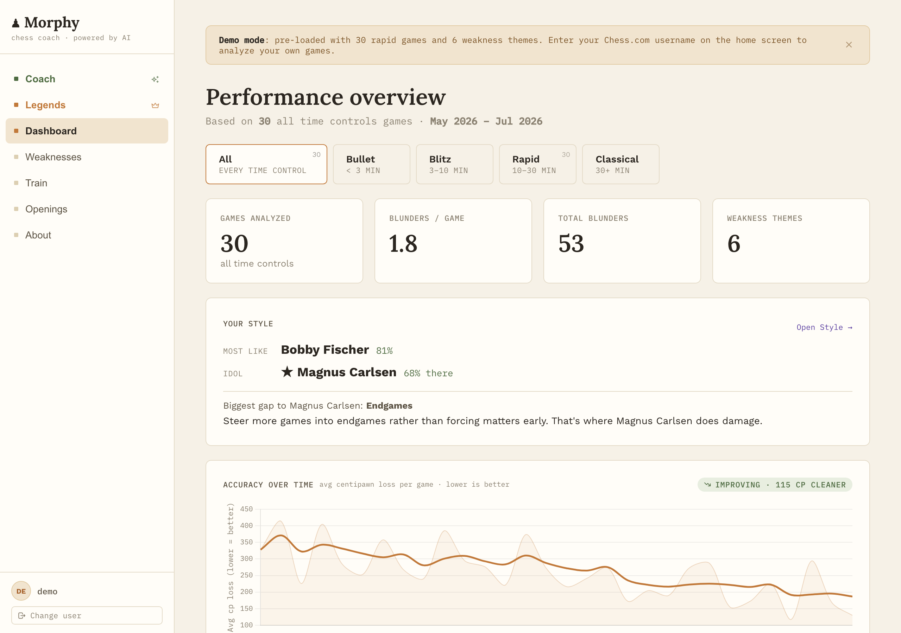
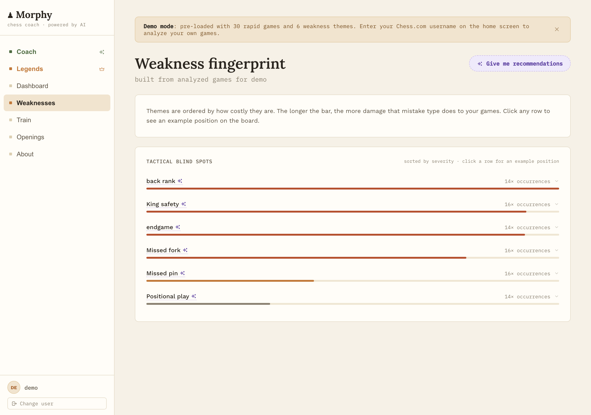
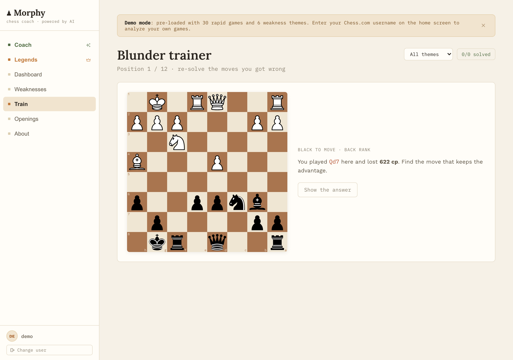
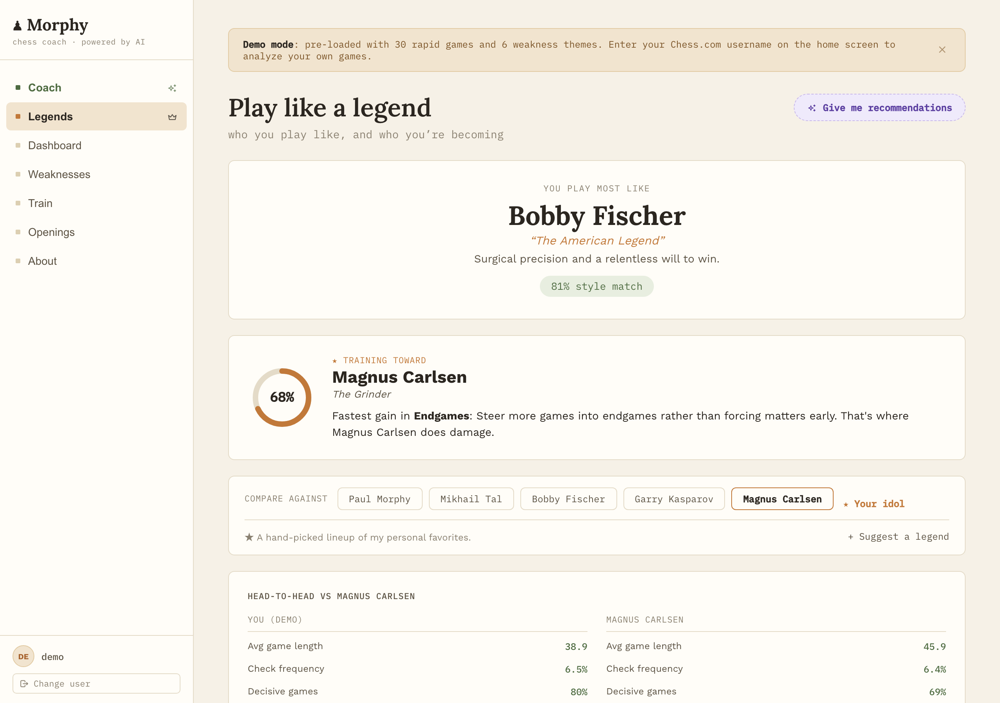

# MORPHY

**An AI chess coach that turns your Chess.com history into a training plan: what you keep getting wrong, why it costs you, and the exact positions to practise.**

**[Try the live demo →](https://morphy-jade.vercel.app)** *(no account needed, click "Try demo")*



*Unedited. The coach names each step as it runs, then writes its answer live, citing the real game, move number and centipawn loss, and rendering the position you blundered in.*

---

## The problem

You finish a game, click analyse, and get a number. 300 centipawns. Now what?

Morphy answers the question the number doesn't: which mistakes you make *repeatedly*, what they're called, and what to drill tomorrow.

---

## What it does

1. **Ingests** your public Chess.com games.
2. **Analyses** every position with Stockfish: best move, centipawn loss, blunder classification.
3. **Names** each blunder. Missed fork, pin, skewer, back-rank, hung piece, bad trade, pawn weakness, detected with python-chess board logic. A named mistake is something you can practise; a number isn't.
4. **Profiles** the motifs that recur, ranked by what they actually cost you (frequency × average severity).
5. **Drills** you on your own blundered positions using Leitner spaced repetition. Fail one and it comes back; master it and it retires. Progress is tracked per theme.
6. **Matches** your style against five grandmasters (Morphy, Tal, Fischer, Kasparov, Carlsen) on decisiveness, endgame tendency, patience, simplification and attack. Their full archives, 13,081 games, run through the same analysis as yours, so the comparison is like for like. You get who you play like, how close you are to the idol you're training toward, and the one habit that closes the gap.
7. **Coaches** you through a Claude agent that pulls all of the above mid-conversation, renders positions on an interactive board, and queues drills of your own mistakes.

---

## Screenshots

| Dashboard | Weakness fingerprint |
|---|---|
|  |  |
| Accuracy over time, your most costly blunder on a board, severity by theme. Filterable by time control. | Themes ranked by what they cost you. Click a row to see the blunder with played and best moves highlighted. |

| Blunder trainer | Legends |
|---|---|
|  |  |
| Re-solve the positions you got wrong. Fail one and it resurfaces, master it and it retires. | Which legend you play like, how close you are to your idol, and the habit that closes the gap. |

---

## Running it locally

**Prerequisites:** Python 3.11+, Node 18+, Stockfish (`brew install stockfish` or `apt-get install stockfish`), and an [Anthropic API key](https://console.anthropic.com) for the coach.

```bash
cd backend
python3 -m venv .venv && source .venv/bin/activate
pip install -r requirements.txt
cp .env.example .env       # set ANTHROPIC_API_KEY=sk-ant-...
uvicorn main:app --reload --port 8000
```

```bash
cd frontend
npm install
npm run dev
```

Open [http://localhost:5173](http://localhost:5173). Enter a Chess.com username, or click **Try demo**. The demo user and GM style profiles seed themselves on first startup.

```bash
cd backend && python -m pytest tests/ -v      # 140 backend tests
cd frontend && npm test                        # 21 frontend tests
npm run lint && npm run typecheck
```

---

## Deployment

The frontend is a static Vite build. The backend needs Stockfish, persistent storage and long-running jobs, so it runs as a Docker service rather than serverless.

**Backend, [Render](https://render.com)** (config in [`render.yaml`](render.yaml)): a Docker service built from `backend/Dockerfile`, which installs Stockfish via apt and verifies the binary at build time. Set `ANTHROPIC_API_KEY` and `CORS_ORIGINS`. Deploy as a **Blueprint** so `render.yaml` is applied; a service created by hand in the dashboard ignores it. It runs on the Starter plan so it never cold-starts and has enough CPU that long Stockfish jobs survive. For durable storage point `DATABASE_URL` at a managed Postgres such as [Neon](https://neon.tech). Leave it unset and the app falls back to SQLite, which resets on restart.

**Frontend, [Vercel](https://vercel.com)**: import the repo, root `frontend`, set `VITE_API_URL` to the Render URL. Preview deployments are automatic on every PR.

---

## How it's built

- **The coach is an agent, not a prompt.** `/coach` runs Claude in a tool-use loop with five tools over your live database. It decides what it needs, calls tools, reads the results, and can call more before answering. ([`coach_agent.py`](backend/agent/coach_agent.py))
- **Grounded in real positions.** Tool results carry the FEN of every blunder, so the model renders *your* positions instead of inventing them, and ties each mistake to a recurring theme. ([`tools.py`](backend/agent/tools.py), [`prompts.py`](backend/agent/prompts.py))
- **Visible while it runs.** A tool-using answer takes 15-20s, since every tool is another round-trip. `/coach/stream` emits Server-Sent Events as the turn happens: each tool as it starts, then the answer token by token. First output drops from ~20s to 1.8s. The plain `/coach` still answers in one shot and the client falls back to it.
- **Latency fixed by measurement.** The opening-stats endpoint took 23s against remote Postgres: an N+1 running one query per game, multiplying round-trip latency ~40x. One query instead took it to 0.6s. ([`stats.py`](backend/stats.py))
- **Bounded by design.** A FEN-keyed cache skips repeat positions and is scoped per user, ingest is capped to the analysis window, and Stockfish is pinned to one thread so engine jobs can't starve the web process.
- **Style fingerprints, precomputed.** The GM corpus is reduced to five axes and committed as `profiles.json`, so deployments need no PGN data. The axes were fitted so grandmasters separate from each other, not just from an amateur baseline. ([`compute_style.py`](backend/gm/compute_style.py))
- **Survives real input.** One corrupt game can't kill a batch, duplicate ingest requests are deduplicated instead of spawning parallel engine runs, and abandoned jobs are reaped so a dead run can't block a user.
- **Shipped like production.** GitHub Actions on every push and PR (pytest, typecheck, ESLint, Vitest, build), 161 tests, Dockerised backend on Render, Vercel previews per PR. ([`ci.yml`](.github/workflows/ci.yml))

### Architecture

```
Chess.com API
      │
      ▼
POST /ingest/{username}                      ← background job; deduped per active user
      │
      ├─ fetch games (httpx, month-by-month)
      ├─ Stockfish analysis (FEN-cached, per-game failure isolation)
      ├─ tactical-motif classification (python-chess)
      ├─ weakness profiling (per-motif aggregation: frequency + avg severity)
      └─ persist via SQLAlchemy (SQLite by default; Postgres via DATABASE_URL)
                  │
                  ▼
         GET  /profile/{username}       · weakness fingerprint + summary stats
         GET  /style/{username}/match   · who you play like, ranked across all GMs
         GET  /style-gap/{username}     · style radar vs. one GM
         GET  /blunders/{username}      · example positions per theme
         GET  /openings/{username}      · repertoire win/loss + accuracy
         GET  /drill/{username}/queue   · spaced-repetition drill queue (due reviews first)
         POST /drill/{username}/attempt · record a drill result; reschedule the card
         GET  /drill/{username}/mastery · per-theme drill progress
         POST /coach                    · agentic loop: Claude + 5 tools over live data
         POST /coach/stream             · same turn, streamed as it runs

  APScheduler → nightly refresh of TRACKED_USERNAMES only (ingest → analyze → re-profile, capped)
```

Each message to `/coach` reads the capped history plus a prompt-cached system prompt and tool schema. If Claude needs data it calls `get_recent_games`, `get_weakness_profile`, `get_game_details`, `get_opening_stats` or `queue_practice`, which run server-side against your database. Results, including FENs, are fed back until it answers. The reply can embed ` ```chess-board ` blocks that the frontend renders as interactive boards. The static prompt and tool definitions are marked `cache_control: ephemeral` so the cache is shared across turns.

### Stack

| Layer | Tech |
|---|---|
| Frontend | React 18, Vite, Chart.js, react-chessboard, react-markdown |
| Backend | FastAPI, SQLAlchemy, SQLite (Postgres via `DATABASE_URL`) |
| Analysis | Stockfish via python-chess, rule-based motif classification |
| Practice | Leitner spaced repetition over your own blunders (Lichess API as fallback) |
| AI coach | Anthropic Claude, tool-use loop with prompt caching |
| CI/CD | GitHub Actions · Render (Docker) · Vercel |
